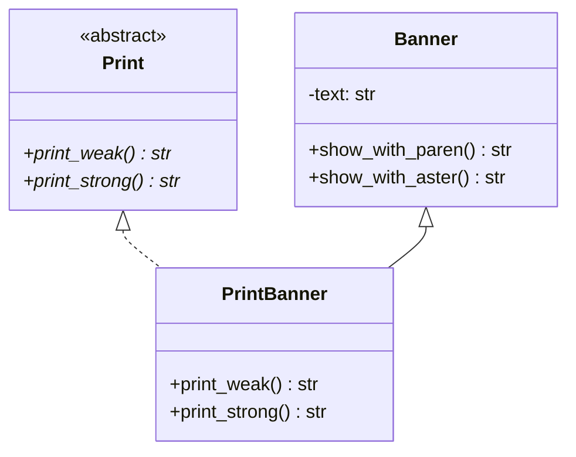

```mermaid
classDiagram
    direction TB
    
    class Print {
        <<abstract>>
        +print_weak()* str
        +print_strong()* str
    }
    
    class Banner {
        -text: str
        +show_with_paren() str
        +show_with_aster() str
    }
    
    class PrintBanner {
        +print_weak() str
        +print_strong() str
    }
    
    Print <|.. PrintBanner
    Banner <|-- PrintBanner
```
