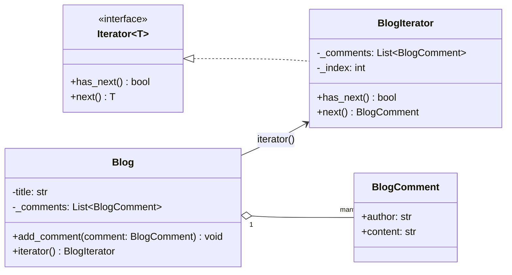

```mermaid
classDiagram
    direction LR

    class Iterator~T~ {
        <<interface>>
        +has_next() bool
        +next() T
    }

    class BlogComment {
        +author: str
        +content: str
    }

    class Blog {
        -title: str
        -_comments: List~BlogComment~
        +add_comment(comment: BlogComment) void
        +iterator() BlogIterator
    }

    class BlogIterator {
        -_comments: List~BlogComment~
        -_index: int
        +has_next() bool
        +next() BlogComment
    }

    Iterator~BlogComment~ <|.. BlogIterator
    Blog "1" o-- "many" BlogComment
    Blog --> BlogIterator : iterator()
```
